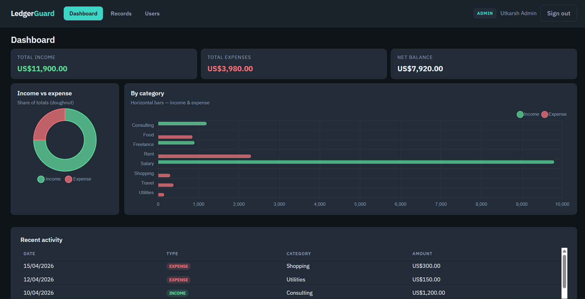
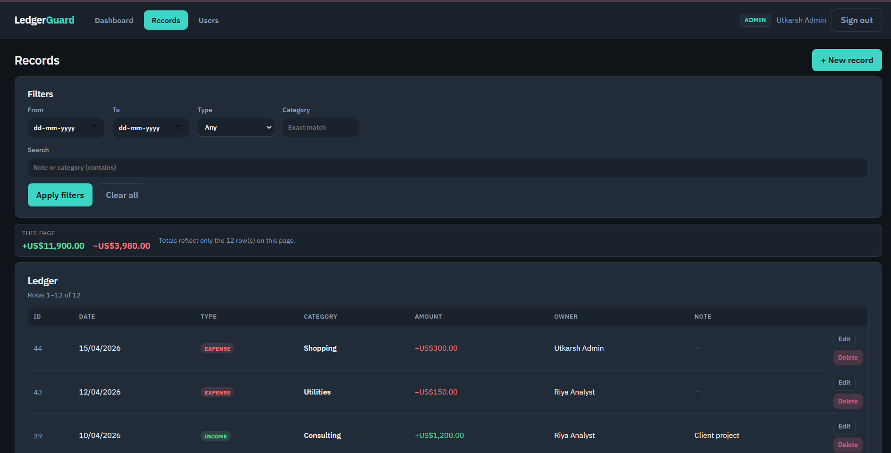
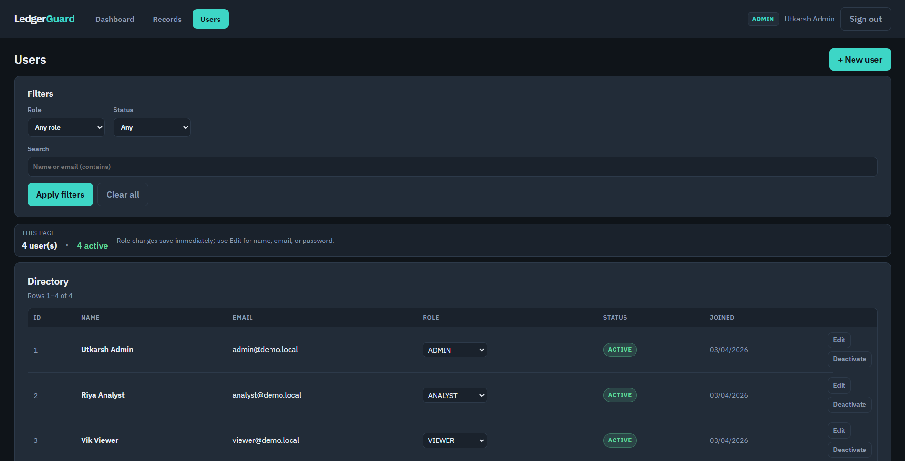

# LedgerGuard

**LedgerGuard** — A REST API and React app for a financial ledger. It uses clear layering (routes → controllers → services), environment validation that fails fast on misconfiguration, and database-backed role checks so access stays correct when roles or accounts change.

This repository is my submission for the **Finance Data Processing and Access Control Backend** assignment. This **README** is the quick path: live app, credentials, API table, and setup. For architecture, decisions, and full assignment discussion, open **[LedgerGuard_Submission.pdf](./docs/LedgerGuard_Submission.pdf)** in `docs/`. **Assumptions** are in [Assumptions](#assumptions).

**Reviewer flow:** skim this page → try the **live demo** → read the **PDF** for depth.

### 🌍 Live Deployments

- **Frontend (Vercel):** [https://ledger-guard-three.vercel.app/](https://ledger-guard-three.vercel.app/)
- **Backend API (Render):** [https://ledgerguard.onrender.com/](https://ledgerguard.onrender.com/)

### Detailed submission (PDF)

**[LedgerGuard_Submission.pdf](./docs/LedgerGuard_Submission.pdf)** — design, implementation notes, and how the work maps to the brief.

### Demo Credentials (Pre-seeded)

Use the same password for every account below—sign in on the **deployed frontend** or, locally, after `npm run db:seed` in `backend/`.

| Email | Password | Role | Access level |
|-------|----------|------|--------------|
| `admin@demo.local` | `ChangeMe!123` | **ADMIN** | Full CRUD over users and records |
| `analyst@demo.local` | `ChangeMe!123` | **ANALYST** | View records and analytics |
| `viewer@demo.local` | `ChangeMe!123` | **VIEWER** | View aggregated dashboard data only |

---

This project is structured as a monorepo containing:

- **`docs/`** — detailed submission write-up ([LedgerGuard_Submission.pdf](./docs/LedgerGuard_Submission.pdf))
- **`backend/`** — Express + Prisma API
- **`frontend/`** — Vite + React UI

## Assignment mapping (core requirements)

How this project maps to the assignment’s **core requirements**:

1. **User and role management** — Create and list users (admin), assign **ADMIN** / **ANALYST** / **VIEWER**, toggle **active/inactive** (`isActive`), register + login, JWT sessions. Role behavior is enforced on every protected request (see middleware and route `restrictTo` usage).
2. **Financial records management** — Records support **amount**, **type** (income/expense), **category**, **date**, and **notes/description**. **Create**, **list** (pagination + filters), **update**, and **delete** (soft delete) are implemented; filters include **date**, **category**, **type**, and **search** on the list endpoint.
3. **Dashboard summary APIs** — Aggregated data for a finance dashboard: **total income**, **total expenses**, **net balance**, **category-wise totals**, **recent activity**, and **trends** (time-bucketed). Implemented as `GET /api/dashboard` plus focused `GET /api/dashboard/*` routes (see API table below).
4. **Access control logic** — **VIEWER**: dashboard-style reads only (no record mutations). **ANALYST**: read records + dashboard/summary access. **ADMIN**: full user and record management. Enforced with **middleware** (`protect`, `restrictTo`) on routes.
5. **Validation and error handling** — **Zod** validation for bodies and queries; **consistent JSON errors**; **appropriate HTTP status codes**; invalid operations rejected in services (e.g. permissions, not found) via a shared error type and global handler.
6. **Data persistence** — **PostgreSQL** with **Prisma** (schema, migrations, seed). Monetary amounts use **decimal** storage; see `backend/prisma/schema.prisma`.

**Optional enhancements included:** JWT authentication, **pagination** for users and records, **search** on records, **soft delete** for ledger rows, **rate limiting** on `/api`, **unit and integration tests**, **Postman collection** (`postman/LedgerGuard.postman_collection.json`), and **deployed** API + frontend (links above).

---

### For evaluators (rubric crosswalk)

| Criterion | Where to look |
|-----------|----------------|
| Backend design | `backend/src/` — `routes` → `controllers` → `services` → Prisma; `backend/src/app.js` |
| Logical thinking / business rules | `backend/src/services/` — user, record, dashboard, auth logic |
| Functionality | API table below; run **Quick Start** and tests |
| Code quality | Controllers (thin), services (rules), shared errors and validators |
| Database / modeling | `backend/prisma/schema.prisma`, migrations |
| Validation / reliability | `backend/src/validators/`, `middleware/`, `utils/AppError.js`, tests |
| Documentation | This README, [docs/LedgerGuard_Submission.pdf](./docs/LedgerGuard_Submission.pdf), [Assumptions](#assumptions) |
| Thoughtfulness | Rate limit, DB-backed role refresh on each request, `Decimal` for money, screenshots |

---

### Architecture

HTTP handling follows **`routes` → `controllers` → `services` → Prisma** (or `$queryRaw` where needed). Entry: `backend/server.js` (`validateEnv`, then listen); app wiring in `backend/src/app.js` (CORS, JSON, rate limit on `/api`, route mounts, global error handler).

| Layer | Role |
|-------|------|
| **Routes** | Paths, `protect` / `restrictTo(...)`, delegate to controllers |
| **Controllers** | Zod validation, HTTP status codes, call services |
| **Services** | Business rules, Prisma, `AppError` for expected failures |
| **Validators** | Zod schemas for bodies and queries |
| **Middleware** | JWT auth, role checks, rate limit, centralized errors |

**Auth model:** JWT payload carries only **`userId`** (`sub`). On each protected request, the API loads the user from the database and attaches **`req.user`** (including **role** and **isActive**), so role changes and deactivations apply immediately without waiting for token expiry.

For HTTP routes and roles, see the **API Details & Routing** section below.

---

## 🚀 Quick Start / Setup

### 1. Database & API (`backend/`)
```bash
git clone <repository-url>
cd backend
copy .env.example .env   # Set your DATABASE_URL + JWT_SECRET here
```

> **Note**: For production, also set `NODE_ENV=production` and `CLIENT_URL` (exact browser origin) to lock down CORS.

```bash
npm install
npx prisma migrate deploy
npm run db:seed          # Seeds the demo accounts listed under Demo Credentials (Pre-seeded)
npm start                # Backend starts listening on http://localhost:5000
```

### 2. Web App (`frontend/`)
In a second terminal (API must remain running for data to appear):
```bash
cd frontend
npm install
npm run dev              # Frontend starts on http://localhost:5173
```
> The vite dev server automatically **proxies** `/api` → `http://localhost:5000` to prevent CORS issues locally.

### Production Build (UI)
```bash
cd frontend
npm run build
```
*Note: Set `VITE_API_BASE_URL` when building if the API is hosted remotely on a different domain.*

---

## Assumptions

The brief allows sensible assumptions where details are unspecified; these are the ones applied here.

- **Admin** has full control: user management and full ledger operations (create, read, update, soft delete).
- **Analyst** can read ledger data and use analytics/insights endpoints; they do not manage users or mutate records.
- **Viewer** is limited to dashboard aggregates; fine-grained record lists and some owner-identifying fields are omitted (see `dashboard.controller.js`).
- **Soft delete** is used for ledger rows (`isDeleted`) instead of physical removal. **Users** are turned off with **`isActive`** rather than deleted in normal operation.

---

## ✨ Features & Optimizations

- **Auth & role checks** — JWT carries only `userId`; each protected request reloads the user from the database so role changes and deactivations apply immediately without waiting for token expiry.
- **Dashboard** — The UI and `/api/dashboard` (plus `/api/dashboard/overview`, `summary`, `categories`, `recent`, `trends`) expose **total income**, **total expense**, **net balance**, **breakdown by category**, **recent activity**, and **time-based trends**. Focused routes allow the frontend to load sections in parallel where useful.
- **Summary performance** — Dashboard aggregation work is run concurrently with `Promise.all()` where appropriate to keep response times low.
- **Frontend requests** — In-flight fetches are aborted on unmount or dependency changes (`AbortController`), which avoids duplicate requests under React Strict Mode double-mounting.
- **Pagination limits** — List endpoints for **users** and **records** cap `limit` at **20** via Zod; dashboard-style queries use their own validated caps (for example, recent items up to **50**).
- **Indexing** — A composite index on `userId`, `createdAt`, and `type` supports efficient filtered and ordered reads for ledger analytics.
- **Money** — Amounts are stored as `Decimal(12,2)` in PostgreSQL and exposed as strings in JSON to avoid floating-point rounding issues in clients.
- **Soft delete (ledger rows)** — Removing a **record** sets **`isDeleted`** instead of deleting the row. **Users** are disabled via **`isActive`** (no hard delete in normal flows).

---

## 🧪 Testing and Verification

From `backend/` after migrating and seeding:
```bash
npm test                  # Unit tests (validators, middleware, services)
npm run test:integration  # Jest + Supertest: auth flows
npm run check:apis        # Scripts through all active routes locally
npm run smoke             # automated smoke testing script
```

---

## 📡 API Details & Routing

All JSON API routes are under **`/api`**. Flow: **`routes` → `controllers` → `services` → Prisma** (or **`$queryRaw`** for trends).

| Method & path | Who | Description |
|---------------|-----|-------------|
| `POST /api/auth/register` | Public | Register; new users get role **VIEWER** |
| `POST /api/auth/login` | Public | JWT + user (no password in response) |
| `GET /api/auth/me` | Authenticated | Current user from DB-backed session |
| `GET`, `POST /api/users` | **ADMIN** | Paginated user directory; create user |
| `GET`, `PATCH /api/users/:id` | **ADMIN** | Get / update user (e.g. **isActive**) |
| `GET /api/records` | **ADMIN**, **ANALYST** | Paginated ledger list (filters: date, category, type, search) |
| `POST /api/records` | **ADMIN** | Create record (optional **userId** for owner; defaults to admin) |
| `PATCH`, `DELETE /api/records/:id` | **ADMIN** | Update or soft-delete a record |
| `GET /api/dashboard` | Authenticated (**VIEWER** allowed) | Combined dashboard data |
| `GET /api/dashboard/overview`, `GET /api/dashboard/summary`, `GET /api/dashboard/categories`, `GET /api/dashboard/recent`, `GET /api/dashboard/trends` | Authenticated (**VIEWER** allowed) | Focused aggregates; **VIEWER** omits some owner-identifying fields (see `dashboard.controller.js`) |

---

## Screenshots

**Dashboard UI**



**Records page**



**User management**



To exercise routes manually, import **`postman/LedgerGuard.postman_collection.json`**. Run **Auth → Login (admin)** to set the `token`, then call protected routes.
